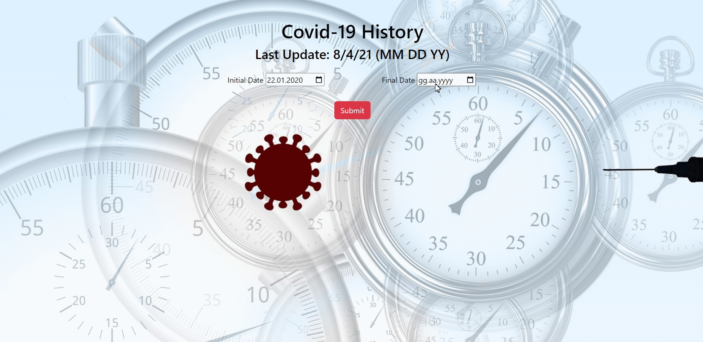
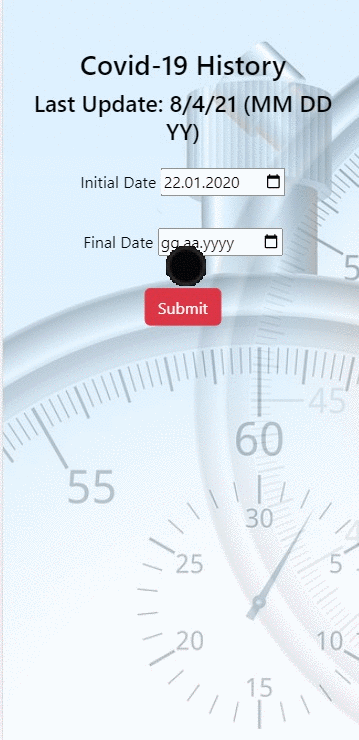

# Covid-19 History

## Description
Project aims to display history of Covid-19 data in the world with fetching disease.sh data.

## Learning Outcomes

At the end of the this project;

- improve <b>HTML/CSS/JavaScript/DOM and API skills </b> 

- improve Plotly.js charting library </b> 

- analyze a problem, data display app populated with a real covid api.

- demonstrate knowledge of algorithmic design principles.


## Project Skeleton 

```
-Covid-19_data_history(folder)
|
|----readme.md                 
|----solution
        |----index.html  
        |----disease.css   
        |----apps.js
        |----covid.jpg
        |----mobile.gif
        |----desktop.gif
```

   
## Problem Statement

- Design a Covid-19 data history page following the design and populate data with using of Fetch API in JS.

User story;

  - User can specify initial and final date.
  - The app can fetch api with the specified date(apikey is not obligatory).
  - User can display covid data of specified date in Plotly.js charting library .
  - User can display data of specified date as a graph.
  - In the API file, the initial and final dates are 22.01.2020, 04.08.2021 respectively. Therefore, if user set the date out of mentioned date, the programme will alert.


<p align="center"> ✍ Happy Coding ⌛ <p>

🔗 To see live version 🎯https://tal58.github.io/API_WORKSHOP/Covid-19_data_history/

🌐 The desktop and mobile versions of the web page are as follows;🧭
<br><br>

## 🖥️Desktop version
<br>

<br>
<br>
<br>
<br>
<br>
<br>
<br>
<br>
<br>
<br>
<br>
<br>
<br>
<br>
<br>
<br>
<br>

## 📱Mobile version
<br>


