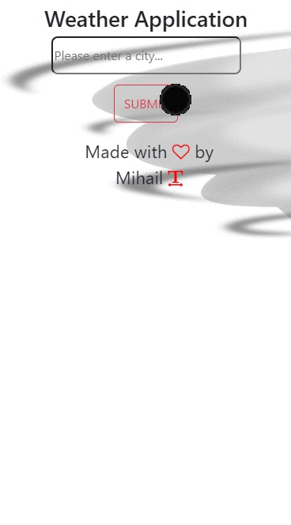

# Weather_Condition_App

## Description
Project aims to display current weather data of searched city around the world with fetching Weather Api data.

## Learning Outcomes

At the end of the this project, students will be able to;

- improve my <b>HTML/CSS/JavaScript/DOM and API skills </b> 

- analyze a problem, create a weather condition app populated with a real weather api.

- demonstrate their knowledge of algorithmic design principles.


## Project Skeleton 

```
-weather_condition_app(folder)
|
|----readme.md                 
|----solution
        |----index.html  
        |----style.css   
        |----apps.js
        |----img
        |----mobile.gif
        |----desktop.gif
```

   
## Problem Statement

- Design a weather condition page following the design and populate data for searched city with using of axios in JS.

User story;

  - User can search city around the world.
  - The app can fetch api with the searched city name(... and apikey if it is obligatory).
  - User can display weather data of searched city in weather card.
  - User can display list of searched city weather data card like on gif.
  - If new searched city is in the weather data list, app can display a warning text to user on page.

🔥 You can use [OpenWeather Api](https://openweathermap.org/) for your app. 

🔥 You don’t need to create a new template for this project, you can use this repository template for html and css.


<p align="center"> ✍ Happy Coding ⌛ <p>

🔗 To see live version 🎯https://tal58.github.io/API_WORKSHOP/Latest_News_from_API_application/

🌐 The desktop and mobile versions of the web page are as follows;🧭
<br><br>

## 🖥️Desktop version
<br>

<br>
<br>
<br>
<br>
<br>
<br>
<br>
<br>
<br>
<br>
<br>
<br>
<br>
<br>
<br>
<br>
<br>

## 📱Mobile version
<br>

