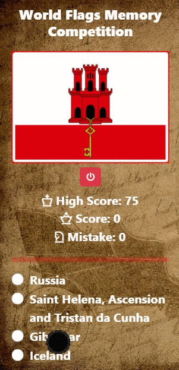

# World Flags Memory Competition by using API

## Description
Project aims to make a game to check your memory about world flags by using API. Randomly display one of the flag and user try find the true answer. 

## Learning Outcomes

At the end of the this project;

- improve HTML/CSS/JS and API abilities.

- analyze a problem, create a original news app.

- demonstrate their knowledge of algorithmic design principles.

   
## Problem Statement

- Design a latest news page following the design and populate data for specified country.

## Project Skeleton 

```
-latest_news(folder)
|
|----readme.md                 
|----solution
        |----index.html  
        |----style.css   
        |----apps.js
        |----desktop.gif
        |----mobile.gif
        |----bg.jpg
        |----f1.jpg
```

<p align="center"> ✍ Happy Coding ⌛ <p>

🔗 To see live version 🎯https://tal58.github.io/API_WORKSHOP/World_flags_memory_competition/

🌐 The desktop version of the web page is as follows;🧭
<br><br>

## 🖥️Desktop version
<br>

<br>
<br>
<br>
<br>
<br>
<br>
<br>
<br>
<br>
<br>
<br>
<br>
<br>
<br>
<br>
<br>
<br>

## 📱Mobile version
<br>


